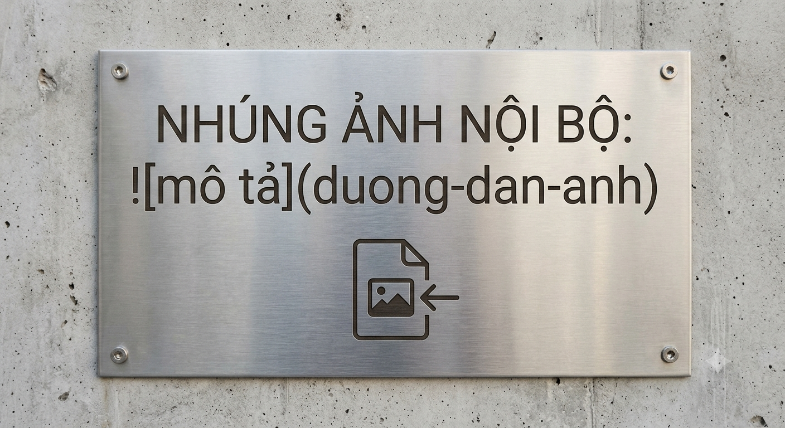

# QUY TRÌNH TIẾP NHẬN VÀ XỬ LÝ SỰ CỐ CÔNG NGHỆ

## 1. Mục đích áp dụng

Tài liệu này được xây dựng nhằm **chuẩn hóa các bước tiếp nhận, phân loại, phối hợp và xử lý yêu cầu kỹ thuật nội bộ** của đơn vị.

### Mục tiêu

- Tiếp nhận yêu cầu nhanh chóng.
- Phân loại đúng mức độ ảnh hưởng.
- Chuyển giao thông tin đến đúng bộ phận phụ trách.
- Đảm bảo thời gian phản hồi và xử lý.
- Theo dõi sự cố đến khi hoàn tất.

> **Lưu ý:** Người tiếp nhận cần ghi nhận đầy đủ thông tin ngay khi phát sinh yêu cầu để tránh thiếu dữ liệu trong quá trình xử lý.

---

## 2. Các bước triển khai

### 2.1. Tiếp nhận

Cán bộ trực tiếp nhận yêu cầu và ghi nhận các thông tin cần thiết:

- Mã lỗi.
- Nội dung sự cố.
- Thông tin người gửi.
- Thời gian phát sinh.
- Hệ thống hoặc thiết bị bị ảnh hưởng.

### 2.2. Phân loại

Đánh giá mức độ ảnh hưởng của sự cố theo hai mức:

- **Mức 1 – Khẩn cấp:** Sự cố ảnh hưởng nghiêm trọng đến hệ thống hoặc nhiều người dùng.
- **Mức 2 – Tiêu chuẩn:** Sự cố ảnh hưởng đến chức năng riêng lẻ nhưng công việc vẫn có thể tiếp tục tạm thời.

### 2.3. Phối hợp xử lý

Sau khi phân loại, chuyển giao thông tin đến bộ phận kỹ thuật chuyên trách để tiến hành kiểm tra và xử lý.

### 2.4. Kiểm tra kết quả

Sau khi xử lý, cần kiểm tra lại tình trạng hệ thống và xác nhận sự cố đã được khắc phục.

### 2.5. Hoàn tất

Ghi nhận kết quả xử lý và đóng yêu cầu sau khi người dùng hoặc bộ phận liên quan xác nhận sự cố đã được giải quyết.

---

## 3. Sơ đồ quy trình

> **Ghi chú:** Sơ đồ trên minh họa trình tự xử lý từ khi tiếp nhận yêu cầu đến khi hoàn tất sự cố.

---

## 4. Bảng mức độ ưu tiên & thời gian xử lý

| Mức độ | Mô tả sự cố | Thời gian phản hồi | Thời gian xử lý tối đa |
| :--- | :--- | :---: | :---: |
| **Mức 1 – Khẩn cấp** | Hệ thống ngừng hoạt động toàn bộ, ảnh hưởng nhiều người dùng | Trong 15 phút | 2 giờ |
| **Mức 2 – Tiêu chuẩn** | Lỗi chức năng riêng lẻ, vẫn có thể làm việc tạm thời | Trong 30 phút | 8 giờ |

> **Quy định thời gian:** Phản hồi lần đầu trong vòng **30 phút** kể từ khi nhận thông tin. Đối với sự cố Mức 1, thời gian phản hồi mục tiêu là **15 phút**.

---

## 5. Thông tin cần cung cấp khi báo sự cố

Để hỗ trợ xử lý nhanh chóng, người gửi cần cung cấp tối thiểu:

| Thông tin | Yêu cầu |
| :--- | :--- |
| Người gửi | Họ tên người yêu cầu |
| Bộ phận | Bộ phận đang làm việc |
| Thời gian | Thời điểm phát sinh sự cố |
| Mã lỗi | Mã lỗi hiển thị trên hệ thống nếu có |
| Nội dung | Mô tả chi tiết sự cố |
| Hình ảnh | Ảnh chụp màn hình hoặc hình ảnh thực tế nếu có |

---

## 6. Kênh tiếp nhận sự cố

### 6.1. Hotline hỗ trợ kỹ thuật

**Hotline:** 0243.xxx.xxx

**Thời gian:** Giờ hành chính

### 6.2. Email tiếp nhận

**Email:** hotro@domain.com

### 6.3. Hệ thống Ticket

Truy cập **cổng hỗ trợ nội bộ** để tạo yêu cầu và theo dõi trạng thái xử lý.

> **Lưu ý bảo mật:** Không gửi mật khẩu, thông tin tài khoản hoặc dữ liệu bảo mật qua các kênh tiếp nhận sự cố.

---

## 7. Trách nhiệm xử lý

| Đối tượng | Trách nhiệm |
| :--- | :--- |
| **Người yêu cầu** | Cung cấp thông tin chính xác và phối hợp kiểm tra |
| **Cán bộ tiếp nhận** | Ghi nhận, phân loại và chuyển giao yêu cầu |
| **Bộ phận kỹ thuật** | Kiểm tra nguyên nhân và thực hiện xử lý |
| **Người xác nhận** | Kiểm tra kết quả và xác nhận hoàn tất |

---

## 8. Nguyên tắc xử lý

1. Ưu tiên xử lý các sự cố có mức độ ảnh hưởng cao.
2. Phản hồi người yêu cầu trong thời gian quy định.
3. Cập nhật tiến độ đối với các sự cố cần nhiều thời gian xử lý.
4. Ghi nhận đầy đủ nguyên nhân và biện pháp khắc phục.
5. Chỉ đóng yêu cầu sau khi sự cố đã được xác nhận hoàn tất.

> **Quan trọng:** Các sự cố khẩn cấp cần được thông báo ngay cho bộ phận kỹ thuật chuyên trách và không chờ đến thời gian xử lý thông thường.

---

## 9. Tóm tắt quy trình

**Tiếp nhận → Phân loại → Phối hợp xử lý → Kiểm tra → Xác nhận → Hoàn tất**

---

## 10. Lịch sử cập nhật

| Phiên bản | Nội dung cập nhật | Ngày |
| :---: | :--- | :---: |
| 1.0 | Khởi tạo tài liệu | 2026 |
| 1.1 | Chuẩn hóa nội dung và định dạng Markdown | 2026 |
| 1.2 | Bổ sung sơ đồ quy trình và chuẩn hóa bảng biểu | 2026 |
